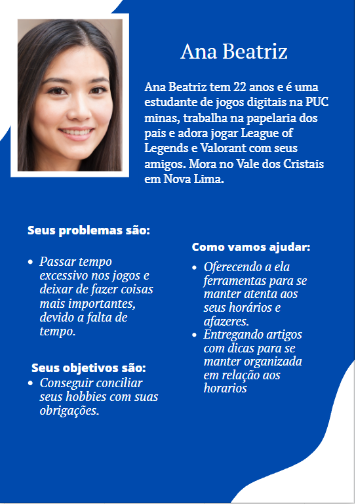
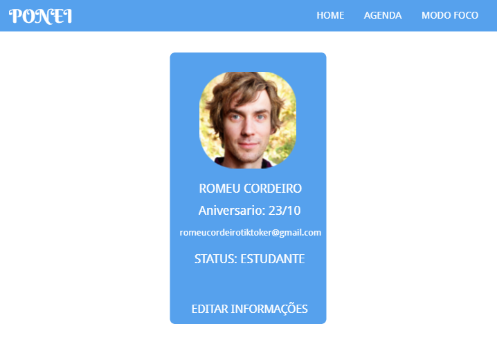

# Informações do Projeto
`TÍTULO DO PROJETO`  

## Ponei

`CURSO` 

## Engenharia de software

## Participantes

- Danilo Augusto Silva Pereira 
- Ernani Procopio Neto
- Vitor Lagares Stahlberg
- Lucas Cabral Soares
- Letícia Rodrigues Blom de Paula
- Thiago Vitor Pereira Perdigao

# Estrutura do Documento

- [Informações do Projeto](#informações-do-projeto)
  - [Participantes](#participantes)
- [Estrutura do Documento](#estrutura-do-documento)
- [Introdução](#introdução)
  - [Problema](#problema)
  - [Objetivos](#objetivos)
  - [Justificativa](#justificativa)
  - [Público-Alvo](#público-alvo)
- [Especificações do Projeto](#especificações-do-projeto)
  - [Personas e Mapas de Empatia](#personas-e-mapas-de-empatia)
  - [Histórias de Usuários](#histórias-de-usuários)
  - [Requisitos](#requisitos)
    - [Requisitos Funcionais](#requisitos-funcionais)
    - [Requisitos não Funcionais](#requisitos-não-funcionais)
  - [Restrições](#restrições)
- [Projeto de Interface](#projeto-de-interface)
  - [User Flow](#user-flow)
  - [Wireframes](#wireframes)
- [Metodologia](#metodologia)
  - [Divisão de Papéis](#divisão-de-papéis)
  - [Ferramentas](#ferramentas)
  - [Controle de Versão](#controle-de-versão)
- [**############## SPRINT 1 ACABA AQUI #############**](#-sprint-1-acaba-aqui-)
- [Projeto da Solução](#projeto-da-solução)
  - [Tecnologias Utilizadas](#tecnologias-utilizadas)
  - [Arquitetura da solução](#arquitetura-da-solução)
- [Avaliação da Aplicação](#avaliação-da-aplicação)
  - [Plano de Testes](#plano-de-testes)
  - [Ferramentas de Testes (Opcional)](#ferramentas-de-testes-opcional)
  - [Registros de Testes](#registros-de-testes)
- [Referências](#referências)

# Introdução

De acordo com o psicólogo e cirurgião plástico Maxwell Maltz em sua obra Psicocibernética, 21 dias, era o prazo para que seus pacientes levavam para se acostumarem com à sua nova imagem, após alguma intervenção cirúrgica. Desta obra, interpreta-se a teoria dos 21 dias, a qual diz que 21 dias é o tempo que o cérebro leva para se acostumar com uma nova rotina. Seguindo este raciocínio, percebe-se que fazer uma rotina virar um hábito, não é a tarefa mais simples do mundo, especialmente para estudantes que possuem altas exigências de produtividade, e muitas vezes ficam sobrecarregadas por elas. Neste quesito, ter uma rotina planejada torna-se uma potencial maior aliada para um dia a dia mais produtivo.
  
Entretanto, encontra-se um desafio na vida diária do estudante: manter tais projetos em dia. Seja por falta de motivação, procrastinação, imprevistos ou pela falta de habilidade de lidar com uma quantidade elevada de tarefas. Tantos motivos levam muitos estudantes a abandonar a rotina inicialmente projetada e não fazer o que estava planejado, o que deprime a produtividade.

Sendo assim, torna-se necessária uma ferramenta para auxiliar na realização de tarefas do dia a dia, permitindo uma maior produtividade aos estudantes, com dicas e instrumentos organizacionais para auxiliar no caminho de uma rotina mais organizada.

## Problema

Conforme exposto, o problema que se busca resolver com este projeto é a dificuldade com a organização pessoal, gestão de tempo e produtividade, principalmente, que estudantes e universitários sentem ao iniciar uma rotina.

## Objetivos

O objetivo geral deste trabalho é a criação de um organizador pessoal, de fácil uso, em que estudantes possam ter um espaço de organização e gestão de tempo.

Como objetivos específicos, podemos ressaltar:
- Propiciar ferramentas que permitem ao usuário visualizar sua rotina e descobrir os melhores horários para cada tarefa;
- Incluir dicas de gestão de tempo;
- Implementar um canal de foco, seguindo a metodologia Pomodoro.

## Justificativa

Um estudo feito em Vitória/ES com 72 participantes sendo 50 transeuntes de 20 e 60 anos e 22 estudantes universitários mostra que para os estudantes, 14% adiam o início da tarefa enquanto 12,5% daqueles que estão na faixa etária entre 20-29 anos fazem o mesmo, sendo que esses dois grupos são os que mais procrastinam.(ENUMO; KERBAUY, 1999).
Além disso, verifica-se uma deficiência em sites que disponibilizam maior variedade de  ferramentas voltadas à produtividade, como o relógio pomodoro, artigos relacionados e opções adicionais para o usuário. 
A criação de tal ferramenta social forneceria uma maior flexibilidade e melhor adequação às suas necessidades para à população que sofre com a desorganização e a protelação.

## Público-Alvo

Jovens de 16 a 25 anos, com foco maior em estudantes, mas nosso público também abrange jovens que já concluíram seus estudos e estão em busca de um primeiro emprego ou que já estão empregados, jovens que utilizam diariamente a tecnologia e já estão bem familiarizados com a mesma, que não possuem muita maturidade ou experiência em administrar seus horários mas possuem interesse em mudar isso.
 
# Especificações do Projeto

A definição exata do problema e os pontos mais relevantes a serem tratados neste projeto foi consolidada com a participação dos usuários em um trabalho de imersão feita pelos membros da equipe a partir da observação dos usuários em seu local natural e por meio de entrevistas. Os detalhes levantados nesse processo foram consolidados na forma de personas e histórias de usuários.

## Personas e Mapas de Empatia

As personas levantadas durante o processo de entendimento do problema são apresentadas na Figuras que se seguem.

**Exemplo de Persona**

## Histórias de Usuários

Com base na análise das personas forma identificadas as seguintes histórias de usuários:

|EU COMO... `PERSONA`| QUERO/PRECISO ... `FUNCIONALIDADE` |PARA ... `MOTIVO/VALOR`                 |
|--------------------|------------------------------------|----------------------------------------|
|Cliente             |Um tipo de agenda que me ajude a organizar meus afazeres diários|Tenho muitos compromissos no meu cotidiano, não consigo administrá-los e acabo deixando muitos de lado sem ao menos me lembrar deles.|
|Cliente             |Uma ferramenta que me motive a realizar meus compromissos.|Sou vagaroso e me distraio com certa facilidade, com essas novas tecnologias acabo passando muito tempo fazendo coisas fúteis como assistir vídeos no tiktok e deixo atividades importantes serem ignoradas.|
|Cliente             |Uma ferramenta que me ajude a focar na tarefa atual.|Perco o foco muito facilmente enquanto realizo minhas atividades acadêmicas.|
|Cliente             |Uma forma de conseguir organizar meu dia a dia.|Ter todas as minhas tarefas bem organizadas para não deixar de cumpri-las.|
|Cliente             |Compartilhar minhas tarefas com meus amigos.|Às vezes sinto necessidade de dividir tarefas com amigos.|
|Cliente             |Um calendário que me ajude a visualizar meus afazeres a longo prazo.|Para ajudar a me planejar com antecedência.|
|Cliente             |Eu quero que seja disponibilizado opções de remover o horário de cada tarefa do meu dia.|Para que eu possa ter mais flexibilidade.|

## Requisitos

### Requisitos Funcionais

|ID    | Descrição do Requisito  | Prioridade |
|------|-----------------------------------------|----|
|RF-001|O site deve apresentar na página principal orientações de como melhorar a organização da rotina.|Alta| 
|RF-002|O site deve apresentar na página principal imagens e textos com cunho motivacional em relação ao tema.|Média|
|RF-003|O site deve permitir ao usuário visualizar o texto completo das orientações com todos os detalhes da publicação|Média|
|RF-004|O site deverá notificar o usuário sobre as tarefas que estão se aproximando.|Média|
|RF-005|O site deve oferecer uma funcionalidade de uma agenda, com a qual o usuário terá a possibilidade de adicionar, retirar e visualizar tarefas.|Alta|
|RF-006|O site deve permitir que o usuário defina prioridade, data e status da tarefa (se está concluída).|Média|
|RF-007|O site deve permitir o compartilhamento de tarefas com outros usuários. |Baixa|
|RF-008|O site oferecer uma função que ajude o usuário a obter foco em alguma tarefa. Sendo essa função cronometrada e com aviso sonoro.|Alta|
|RF-009|O site deverá oferecer a funcionalidade de criar um login com senha.|Alta|
|RF-010|O site deverá oferecer a funcionalidade de personalizar o perfil de usuário. |Baixa|
|RF-011|O site deverá oferecer uma função de modo noturno.|Baixa|

### Requisitos não Funcionais

|ID     | Descrição do Requisito  |Prioridade |
|-------|-------------------------|----|
|RNF-001|O site deve ser publicado em um ambiente acessível publicamente na Internet (Repl.it, GitHub Pages, Heroku); |Alta| 
|RNF-002|O site deverá ser responsivo permitindo a visualização em um celular de forma adequada|Alta|
|RNF-003|O site deve ter bom nível de contraste entre os elementos da tela em conformidade |Média|
|RNF-004|O site deve ser compatível com os principais navegadores do mercado (Google Chrome, Firefox, Microsoft Edge)|Alta|

## Restrições

|ID| Restrição                                             |
|--|-------------------------------------------------------|
|01| O projeto deverá ser entregue no final do semestre letivo, não podendo extrapolar a data de 07/07/2020. |
|02|O aplicativo deve se restringir às tecnologias básicas da Web no Frontend|
|03|A equipe não pode subcontratar o desenvolvimento do trabalho.|

# Projeto de Interface

Dentre as preocupações para a montagem da interface do sistema, estamos estabelecendo foco em questões como agilidade, acessibilidade e usabilidade. Desta forma, o projeto tem uma identidade visual padronizada em todas as telas que são projetadas para funcionamento em desktops e dispositivos móveis.

## User Flow

O diagrama apresentado na Figura X mostra o fluxo de interação do usuário pelas telas do sistema. Cada uma das telas deste fluxo é detalhada na seção de Wireframes que se segue. Para visualizar o wireframe interativo, acesse o ambiente MarvelApp do projeto.

## Wireframes

### Tela - Home-Page
A tela de home-page mostra ícones com dicas e artigos visando a melhor organização da rotina. 
Com base na estrutura padrão, o bloco de conteúdo traz as dicas em destaque (imagem, título). O cabeçalho traz cinco elementos distintos:
- Componente agenda que leva o usuário para a TELA - AGENDA;
- Componente modo foco que leva o usuário para a TELA - MODO FOCO;
- Componente com uma foto que leva o usuário para a TELA - PERFIL.
- Componente home atualiza a página. (em outras páginas leva de volta a TELA - HOME)
- Componente com um ícone de notificação ativa as notificações.

### Tela - Login
A tela de login apresenta a possibilidade para o usuário cadastrado de entrar com sua conta pessoal, sendo redirecionado para a Home-Page. Caso o usuário não seja cadastrado, quando clicar em “Ainda não tem cadastro?”, é redirecionado à página de Cadastro.

### Tela - Cadastro
A página de cadastro pede ao usuário, seu nome, seu email e uma senha para criar uma conta, sendo assim, redirecionado para a Home-Page, após de criada. Caso o usuário já tenha cadastro, quando clicado em “Já tem cadastro?”, o usuário é redirecionado para a página de Login.

### Tela - Agenda
A tela de Agenda apresenta o calendário do mês e as tarefas do dia. Também, a possibilidade de agendar uma tarefa. No cabeçalho, existe a opção de ir para a página Home, para a página Modo Foco, e para o perfil do usuário.

### Tela - Modo Foco
A tela de Modo Foco contém um cronômetro regressivo que conforme o método Pomodoro, separa 25 minutos de foco e 5 minutos de descanso, sucessivamente por 3 vezes. No final dos 25 minutos, muda para short break de 5 minutos e no final do ciclo o foco é mudado para long break de 10 minutos. A contagem dos ciclos constam no canto inferior esquerdo da página. No cabeçalho, tem a opção de Home, Agenda e usuário.

### Tela - Artigo aberto
A tela que contém o artigo anexado na Home-Page. São artigos que ensinam como melhorar sua rotina e quais as vantagens disso. No cabeçalho, existe a opção de ir para a página Home, para a página Agenda, para a página Modo Foco, para o perfil do usuário.

### Tela -  Perfil
A tela de perfil é a página do usuário dono da conta, nela é possível definir e acessar o nome, o aniversário, o email, e o status do usuário. No cabeçalho, existe a opção de ir para a página Home, para a página Modo Foco, e para a página Agenda.

# Metodologia

A metodologia contempla as definições de ferramental utilizado pela equipe tanto para a manutenção dos códigos e demais artefatos quanto para a organização do time na execução das tarefas do projeto.
## Relação de Ambientes de Trabalho
Os artefatos do projeto são desenvolvidos a partir de diversas plataformas e a relação dos ambientes com seu respectivo propósito é apresentada na tabela que se segue. 

## Divisão de Papéis

(https://trello.com/invite/b/TrsN2xWQ/901fb64765607e524609210679b5a374/ponei)

## Ferramentas

......  COLOQUE AQUI O SEU TEXTO - SIGA O EXEMPLO DA TABELA ABAIXO  ......

| Ambiente  | Plataforma              |Link de Acesso |
|-----------|-------------------------|---------------|
|Processo de Design Thinkgin  | Miro |  https://miro.com/app/board/uXjVPWk61J8=/ | 
|Repositório de código | GitHub | https://github.com/JamesTide/TI1 | 
|Hospedagem do site | Heroku |  https://XXXXXXX.herokuapp.com | 
|Protótipo Interativo | MavelApp | https://marvelapp.com/project/6427941 | 

# **############## SPRINT 1 ACABA AQUI #############**

## Controle de Versão

......  COLOQUE AQUI O SEU TEXTO ......

> Discuta como a configuração do projeto foi feita na ferramenta de
> versionamento escolhida. Exponha como a gerência de tags, merges,
> commits e branchs é realizada. Discuta como a gerência de issues foi
> realizada.
> A ferramenta de controle de versão adotada no projeto foi o
> [Git](https://git-scm.com/), sendo que o [Github](https://github.com)
> foi utilizado para hospedagem do repositório `upstream`.
> 
> O projeto segue a seguinte convenção para o nome de branchs:
> 
> - `master`: versão estável já testada do software
> - `unstable`: versão já testada do software, porém instável
> - `testing`: versão em testes do software
> - `dev`: versão de desenvolvimento do software
> 
> Quanto à gerência de issues, o projeto adota a seguinte convenção para
> etiquetas:
> 
> - `bugfix`: uma funcionalidade encontra-se com problemas
> - `enhancement`: uma funcionalidade precisa ser melhorada
> - `feature`: uma nova funcionalidade precisa ser introduzida
>
> **Links Úteis**:
> - [Tutorial GitHub](https://guides.github.com/activities/hello-world/)
> - [Git e Github](https://www.youtube.com/playlist?list=PLHz_AreHm4dm7ZULPAmadvNhH6vk9oNZA)
> - [5 Git Workflows & Branching Strategy to deliver better code](https://zepel.io/blog/5-git-workflows-to-improve-development/)
>
> **Exemplo - GitHub Feature Branch Workflow**:
>
> 

# Projeto da Solução

......  COLOQUE AQUI O SEU TEXTO ......

## Tecnologias Utilizadas

......  COLOQUE AQUI O SEU TEXTO ......

> Descreva aqui qual(is) tecnologias você vai usar para resolver o seu
> problema, ou seja, implementar a sua solução. Liste todas as
> tecnologias envolvidas, linguagens a serem utilizadas, serviços web,
> frameworks, bibliotecas, IDEs de desenvolvimento, e ferramentas.
> Apresente também uma figura explicando como as tecnologias estão
> relacionadas ou como uma interação do usuário com o sistema vai ser
> conduzida, por onde ela passa até retornar uma resposta ao usuário.
> 
> Inclua os diagramas de User Flow, esboços criados pelo grupo
> (stoyboards), além dos protótipos de telas (wireframes). Descreva cada
> item textualmente comentando e complementando o que está apresentado
> nas imagens.

## Arquitetura da solução

......  COLOQUE AQUI O SEU TEXTO E O DIAGRAMA DE ARQUITETURA .......

> Inclua um diagrama da solução e descreva os módulos e as tecnologias
> que fazem parte da solução. Discorra sobre o diagrama.
> 
> **Exemplo do diagrama de Arquitetura**:
> 
> 

# Avaliação da Aplicação

......  COLOQUE AQUI O SEU TEXTO ......

> Apresente os cenários de testes utilizados na realização dos testes da
> sua aplicação. Escolha cenários de testes que demonstrem os requisitos
> sendo satisfeitos.

## Plano de Testes

......  COLOQUE AQUI O SEU TEXTO ......

> Enumere quais cenários de testes foram selecionados para teste. Neste
> tópico o grupo deve detalhar quais funcionalidades avaliadas, o grupo
> de usuários que foi escolhido para participar do teste e as
> ferramentas utilizadas.
> 
> **Links Úteis**:
> - [IBM - Criação e Geração de Planos de Teste](https://www.ibm.com/developerworks/br/local/rational/criacao_geracao_planos_testes_software/index.html)
> - [Práticas e Técnicas de Testes Ágeis](http://assiste.serpro.gov.br/serproagil/Apresenta/slides.pdf)
> -  [Teste de Software: Conceitos e tipos de testes](https://blog.onedaytesting.com.br/teste-de-software/)

## Ferramentas de Testes (Opcional)

......  COLOQUE AQUI O SEU TEXTO ......

> Comente sobre as ferramentas de testes utilizadas.
> 
> **Links Úteis**:
> - [Ferramentas de Test para Java Script](https://geekflare.com/javascript-unit-testing/)
> - [UX Tools](https://uxdesign.cc/ux-user-research-and-user-testing-tools-2d339d379dc7)

## Registros de Testes

......  COLOQUE AQUI O SEU TEXTO ......

> Discorra sobre os resultados do teste. Ressaltando pontos fortes e
> fracos identificados na solução. Comente como o grupo pretende atacar
> esses pontos nas próximas iterações. Apresente as falhas detectadas e
> as melhorias geradas a partir dos resultados obtidos nos testes.

# Referências

......  COLOQUE AQUI O SEU TEXTO ......

> Inclua todas as referências (livros, artigos, sites, etc) utilizados
> no desenvolvimento do trabalho.
> 
> **Links Úteis**:
> - [Formato ABNT](https://www.normastecnicas.com/abnt/trabalhos-academicos/referencias/)
> - [Referências Bibliográficas da ABNT](https://comunidade.rockcontent.com/referencia-bibliografica-abnt/)
